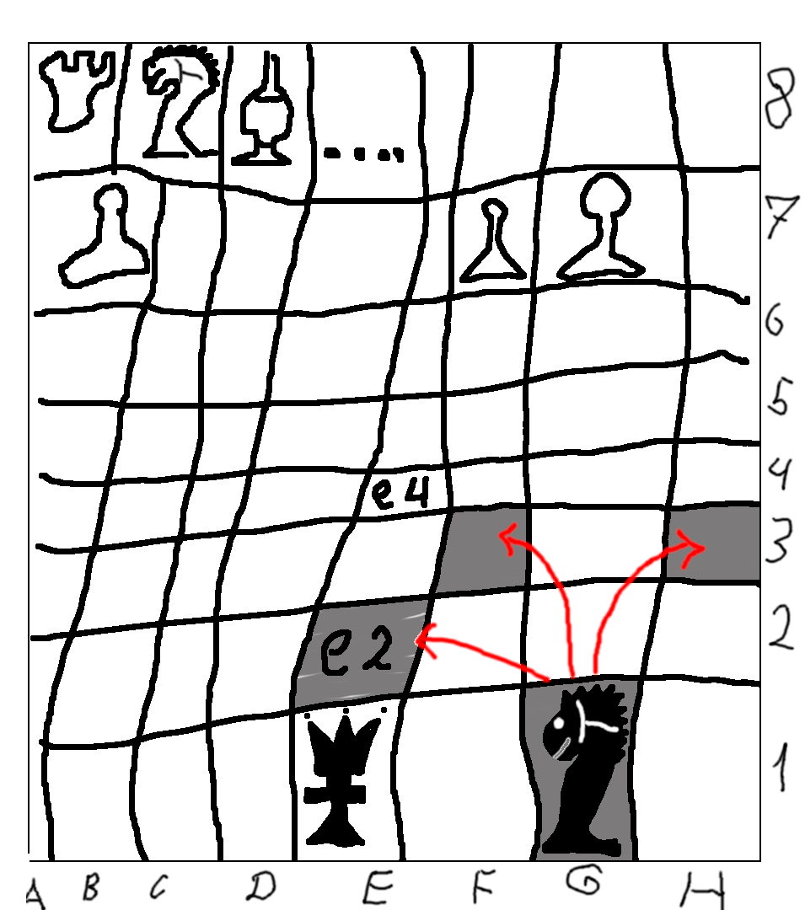

# CHESS # 
---
### How to:
```
make install
make [lang=(en|ru|uk)] run
```

---
### Постановка задачи(неформально):

Разработать приложение, позволяющее:
+ рубиться в шахматы с собой
+ рубиться в шахматы с другими пользователями
+ (опционально) рубиться в шахматы с другими пользователями по сети
+ (опционально) рубиться в шахматы с AI
+ (опционально) рубиться в шахматы с Randombot'ом
+ *возможно* что-то еще


Приложение должно обладать графической оболочкой, иметь приятный глазу дизайн.
Модель находится в разработке.


---
### Участники

[Коновальчук Дмитрий Сергеевич](https://github.com/sudofind/)

[Ковальков Борис Юрьевич](https://github.com/be4r/)

---
### Макет:


Сначала должно быть стартовое окно, позволяющее пользователю выбрать, хочет он играть с собой или не хочет. 

И еще название игры, чтоб не забыть, что вообще происходит. Выглядит, приблизительно, так:


Если пользователь все же решится играть с собой, он попадет на окно следующего вида: 

~~извините, я не художник, а рисовать как-то нужно~~



Оно должно моделировать шахматную доску из реального мира, которая в свою очередь выгядит так:


